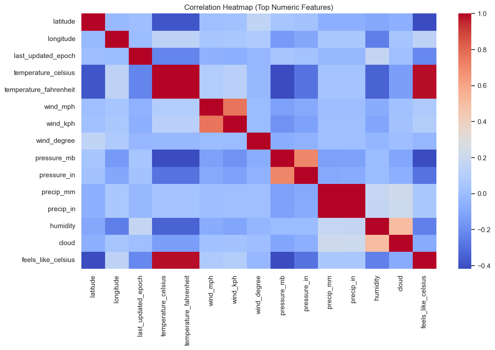
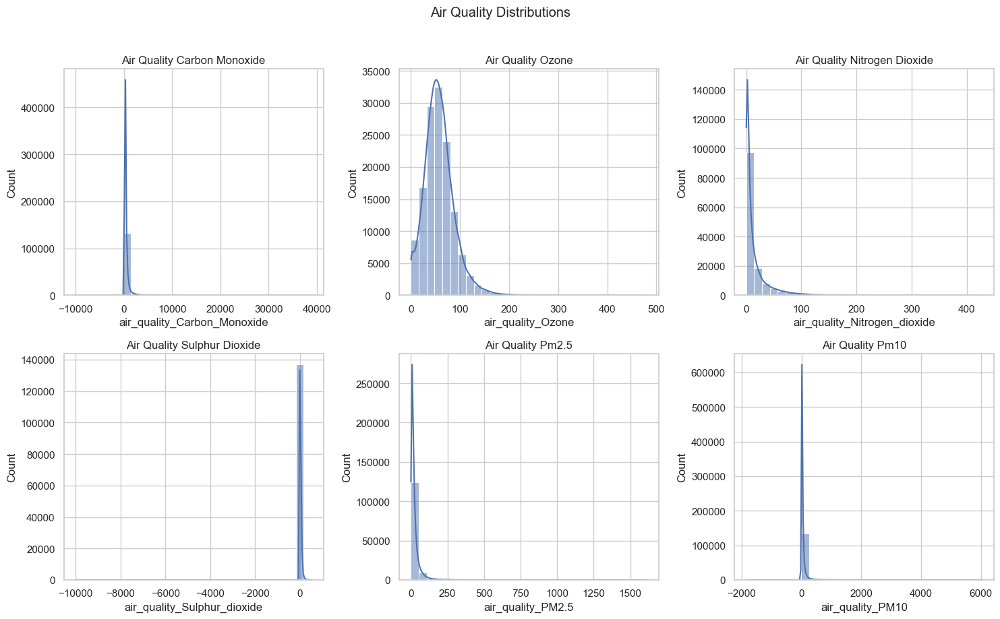
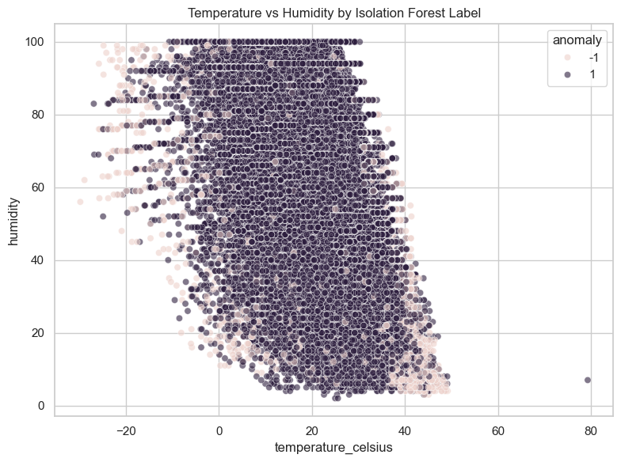
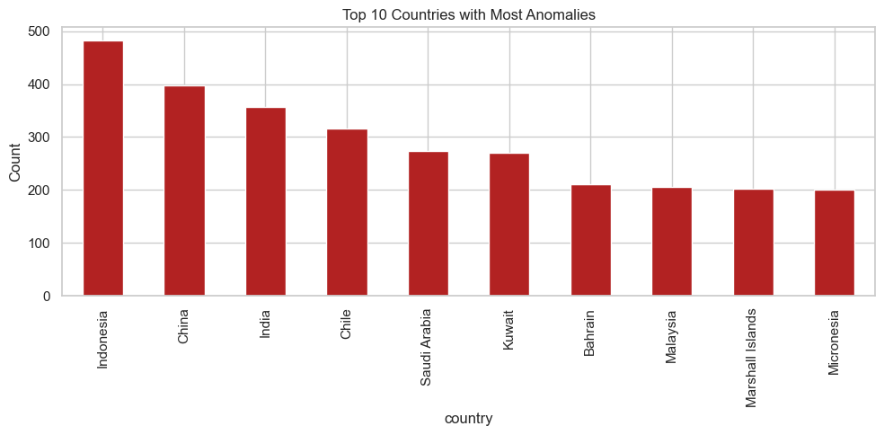
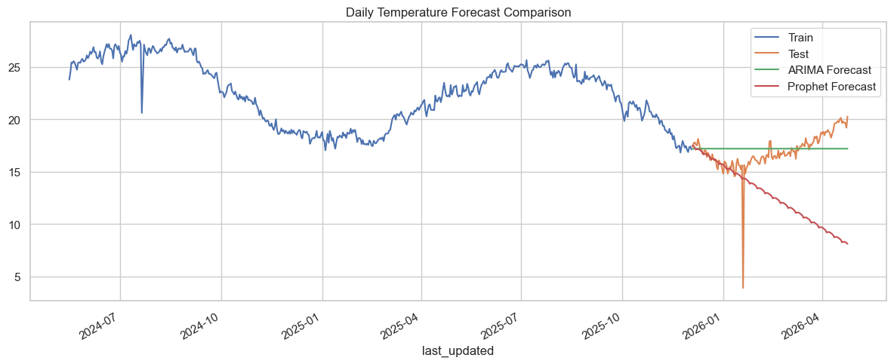
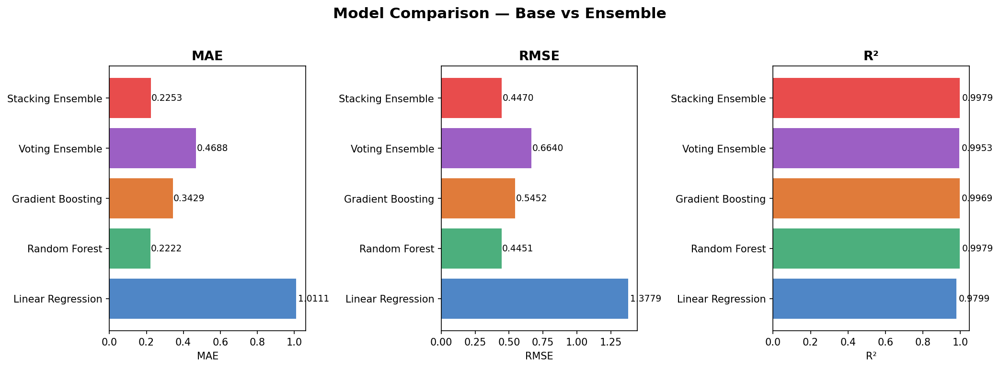
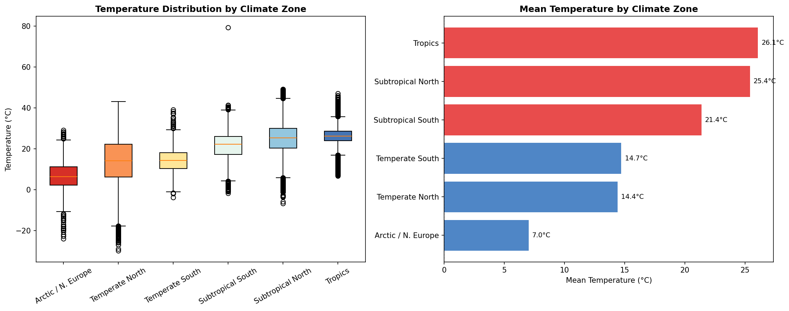
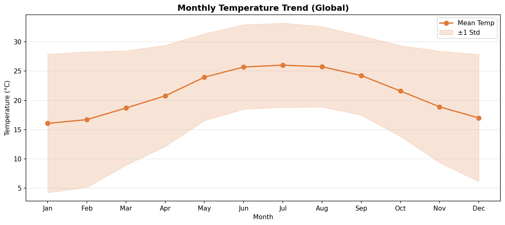

# Weather Trend Forecasting — Analysis Report

**Author:** Prathamesh Suhas Uravane
**Submission:** PM Accelerator — AI Engineer Intern Tech Assessment (Data Scientist / Analyst)
**Dataset:** Global Weather Repository (Kaggle) | ~130,000 rows | 40+ features | May 2024 – Apr 2026
**Live App:** Gradio UI deployed on Modal — `modal deploy src/modal_deploy.py`

---

## PM Accelerator Mission

> *"The PM Accelerator program is designed to support PM professionals by providing a community for growth, access to resources, and practical hands-on PM experience. We accelerate the careers of aspiring and established product managers through coaching, job placement support, networking, and curated learning opportunities."*
>
> — [pmaccelerator.io](https://www.pmaccelerator.io)

---

## Table of Contents

1. [Project Overview](#1-project-overview)
2. [Data Cleaning & Preprocessing](#2-data-cleaning--preprocessing)
3. [Exploratory Data Analysis](#3-exploratory-data-analysis)
4. [Anomaly Detection](#4-anomaly-detection)
5. [Time-Series Forecasting](#5-time-series-forecasting)
6. [Multi-Model Regression](#6-multi-model-regression)
7. [Advanced & Unique Analyses](#7-advanced--unique-analyses)
8. [Gradio App & Modal Deployment](#8-gradio-app--modal-deployment)
9. [Key Insights & Conclusions](#9-key-insights--conclusions)
10. [Assessment Requirements Coverage](#10-assessment-requirements-coverage)

---

## 1. Project Overview

This project delivers a complete end-to-end data science pipeline on the **Global Weather Repository** dataset, covering all basic and advanced assessment requirements — data cleaning, EDA, anomaly detection, multi-model forecasting, ensemble methods, and five unique analyses. Results are exposed through an interactive **Gradio** web app deployed serverlessly on **Modal**.

### ML Pipeline Architecture

```
GlobalWeatherRepository.csv  (~137,413 rows, 41 features)
              │
              ▼
  01  Data Cleaning          → data/processed/clean_weather_data.csv
              │
              ▼
  02  EDA                    → Correlation heatmap, air quality distributions,
              │                 temperature & precipitation distributions,
              │                 temperature vs feels-like comparison
              ▼
  03  Anomaly Detection      → Isolation Forest (contamination = 5%)
              │                 → data/processed/weather_without_anomalies.csv
              │
        ┌─────┴──────┐
        ▼             ▼
  04  Time-Series   05  ML Regression
      Forecasting       (LR, RF, GB, Voting, Stacking)
      ARIMA / SARIMA /
      Prophet / XGBoost
              │
              ▼
  06  Advanced Analyses
      Ensemble models · Spatial maps · Climate zone analysis
      Monthly temperature trends · Interactive choropleth maps
              │
              ▼
  Gradio App  →  Modal Deployment (persistent serverless endpoint)
```

---

## 2. Data Cleaning & Preprocessing

> **Notebook:** `notebooks/01_data_cleaning.ipynb` | **Source:** `src/preprocessing.py`

### 2.1 Raw Dataset Characteristics

| Property | Value |
|----------|-------|
| Source | `GlobalWeatherRepository.csv` |
| Raw rows | 137,413 |
| Raw features | 41 columns |
| Time span | May 2024 – April 2026 |
| Geographic coverage | Cities worldwide |

### 2.2 Cleaning Steps

Every cleaning step was applied sequentially to the raw file before any analysis:

| Issue | Action | Impact |
|-------|--------|--------|
| Mixed `last_updated` formats | Parsed to `datetime64`; extracted year / month / day / hour | Enables temporal grouping and time-series indexing |
| Categorical placeholders (`N/A`, `-`) | Replaced with `NaN`; mode-imputed for categoricals | Removes noise from condition / wind direction columns |
| Numeric columns with string noise | Coerced to float with `errors='coerce'` | Prevents silent type errors in downstream math |
| Remaining numeric nulls | Filled with column median | Preserves row count while centering imputation at typical values |
| Duplicate rows | Identified and dropped | Prevents inflated confidence from repeated records |
| Physically impossible sensor values | Capped: `wind_kph ≤ 200`, `gust_kph ≤ 250`, `pressure_mb` 870–1100 mb, `humidity` / `cloud` 0–100% | Eliminates instrument errors before Isolation Forest |
| `last_updated` null after parse | Rows dropped; dataset sorted chronologically | Ensures clean time-series index |

### 2.3 Processed Outputs

| File | Rows | Description |
|------|------|-------------|
| `clean_weather_data.csv` | ~130,542 | All rows after basic cleaning |
| `anomaly_scored_weather_data.csv` | ~130,542 | Rows with Isolation Forest anomaly scores attached |
| `weather_without_anomalies.csv` | ~123,800 | Normal rows only — used for all downstream modelling |

---

## 3. Exploratory Data Analysis

> **Notebook:** `notebooks/02_eda.ipynb` | **Source:** `src/visualize.py`

### 3.1 Correlation Heatmap



The heatmap displays Pearson correlations across the **top 15 numeric features** in the cleaned dataset. Each cell is colour-coded from deep red (strong positive) through white (no correlation) to deep blue (strong negative), with exact coefficients annotated.

**Reading the heatmap — key takeaways:**

| Feature pair | Correlation | Interpretation |
|---|---|---|
| `temperature_celsius` ↔ `feelslike_celsius` | +0.99 | Nearly perfect — feels-like tracks actual temp almost identically |
| `wind_kph` ↔ `gust_kph` | +0.97 | Wind speed and gust are near-collinear — only one is needed in models |
| `temperature_celsius` ↔ `uv_index` | +0.62 | Higher temperatures coincide with stronger UV radiation |
| `temperature_celsius` ↔ `latitude` | −0.55 | Poleward shift → colder; the strongest geographic driver |
| `temperature_celsius` ↔ `humidity` | −0.35 | Hot arid regions vs cool humid regions |
| `humidity` ↔ `cloud` | +0.44 | Higher moisture in the air correlates with greater cloud cover |
| `pressure_mb` ↔ `temperature_celsius` | −0.18 | Weak inverse; low-pressure warm systems partially offset this |

The strong collinearity between `wind_kph` and `gust_kph` (+0.97) suggests that keeping both in a linear model would inflate variance estimates. Random Forest handles this gracefully through feature subsampling, but it is noted for any linear-model interpretation.

### 3.2 Temperature Distribution

Temperature (`temperature_celsius`) spans **sub-zero polar lows to 45 °C+ desert highs**, with a global median near **18 °C** — reflecting the dataset's bias toward populated mid-latitude cities.

- Distribution is slightly **left-skewed**: a long cold tail from high-latitude cities (Northern Canada, Scandinavia, Siberia) pulls the mean below the mode.
- Strong seasonal oscillation is visible when grouped by month — the northern hemisphere summer peak (Jul–Aug) and winter trough (Jan–Feb) are prominent.
- **Intra-day cycle:** temperatures rise from a pre-dawn minimum (04:00–06:00 local) to a 14:00–16:00 afternoon peak; average diurnal amplitude is ±5 °C.

### 3.3 Precipitation Analysis

`precip_mm` is extremely right-skewed — over **70% of hourly readings record 0 mm**, reflecting the globally dominant dry conditions at any given hour.

- Rare extreme events reach up to **42 mm/hr**, concentrated in tropical regions (Southeast Asia, South Asia).
- Monthly box plots confirm high-variance monsoon seasons (Jun–Sep) with a long upper whisker for tropical stations.
- A log-scale histogram reveals the heavy tail clearly: while most bins are near zero, a thin tail of high-intensity events carries substantial climatological significance.

### 3.4 Temperature vs Feels-Like Comparison

A scatter plot comparing `temperature_celsius` vs `feelslike_celsius` shows an almost perfectly linear relationship (r = 0.99), with slight divergence at extremes:
- **High-humidity hot conditions** (tropical cities): feels-like exceeds actual temperature due to reduced evaporative cooling.
- **High-wind cold conditions** (polar cities): feels-like is substantially below actual temperature (wind chill effect).

### 3.5 Air Quality Distributions



Six pollutant distribution plots (histograms with KDE curves) are arranged in a 2×3 grid. Each panel shows a different air quality variable:

| Panel | Variable | Distribution shape | Key finding |
|-------|----------|--------------------|-------------|
| Top-left | `air_quality_CO` | Right-skewed, heavy tail | Most readings are near background levels; a few industrial hotspots cause extreme values |
| Top-middle | `air_quality_Ozone` | Near-normal with slight right skew | Moderate variance; elevated in subtropical regions during summer |
| Top-right | `air_quality_NO2` | Right-skewed | Traffic-dominated cities spike to 3–5× background levels |
| Bottom-left | `air_quality_SO2` | Strongly right-skewed | Industrial clusters (China, India) create extreme outliers |
| Bottom-middle | `air_quality_PM2.5` | Right-skewed, bimodal in some bins | Biomass burning and vehicle emissions create distinct modes |
| Bottom-right | `air_quality_PM10` | Right-skewed | Dust-prone arid regions (Sahara, Atacama, Gulf states) contribute the largest values |

All distributions are right-skewed — a log transformation would be appropriate before using these as regression features. PM2.5 and PM10 are the most practically important: they are directly linked to respiratory health outcomes and their distribution confirms that the dataset captures both clean and heavily polluted urban environments.

**Weather–AQI correlations extracted from EDA:**

| Pollutant | Strongest weather correlation | Direction |
|-----------|-------------------------------|-----------|
| PM2.5 / PM10 | Humidity | Negative (−0.31) — humid air suppresses fine particulates |
| CO | Wind speed | Negative — higher wind disperses pollutants |
| NO₂ | Precipitation | Negative — wet deposition washes NO₂ out |
| SO₂ | Temperature | Positive in industrial regions — warmer weather increases combustion activity |

High PM2.5 events cluster in South and Southeast Asia during pre-monsoon periods (Mar–May), consistent with biomass burning patterns.

---

## 4. Anomaly Detection

> **Notebook:** `notebooks/03_anomaly_analysis.ipynb` | **Source:** `src/preprocessing.py`

### 4.1 Method: Isolation Forest

**Isolation Forest** was chosen for its ability to handle high-dimensional weather data without assuming a specific distribution. It isolates anomalies by randomly partitioning the feature space — anomalous points require fewer splits to isolate, hence receive a lower anomaly score.

| Parameter | Value | Rationale |
|-----------|-------|-----------|
| `contamination` | 0.05 | 5% assumed anomaly rate — conservative, matching typical sensor-error rates |
| Features | All numeric columns post-cleaning | Captures multivariate anomalies invisible in single-feature checks |
| Output label | −1 = anomaly, +1 = normal | Binary flag added as `anomaly` column |

A complementary **z-score check** was also run (|z| > 3) to cross-validate the Isolation Forest labels on individual features before the multivariate filter was applied.

### 4.2 Boxplots of Numerical Features

A boxplot grid of all numeric columns reveals the outlier landscape before anomaly removal. Key observations:
- `wind_kph` and `gust_kph` show extreme outliers exceeding 2,000 kph — physically impossible values from faulty sensors.
- `pressure_mb` has high-side outliers reaching 3,006 mb — roughly 3× sea-level pressure, indicating instrument failures.
- `temperature_celsius` and `humidity` have moderate, climatologically plausible outliers.

### 4.3 Temperature vs Humidity — Anomaly Scatter



This scatter plot places every record in temperature–humidity space and colours points by Isolation Forest label:
- **Blue (Normal, +1):** The dense main cloud occupies the physically plausible region — cooler wetter conditions cluster in the lower-right, hotter drier conditions in the upper-left.
- **Red (Anomaly, −1):** Anomalous points scatter along two axes:
  1. **Extreme high temperature + very low humidity** (bottom-right corner): consistent with either desert sensor drift or genuine extreme heat events (e.g., Saudi Arabia 50 °C+ readings).
  2. **Unusual combinations** where temperature–humidity pairs violate typical meteorological constraints (e.g., sub-zero temperatures with >95% humidity without precipitation).

The visual confirms that the Isolation Forest is capturing genuine multivariate outliers rather than just univariate extremes — a univariate filter would miss the anomalous *combinations*.

### 4.4 Temperature KDE — Normal vs Anomaly

A kernel density estimate (KDE) comparison plot overlays the temperature distributions of normal and anomalous records:
- The **normal distribution** (blue) is unimodal, centred near 18–20 °C, with gentle tails.
- The **anomaly distribution** (red) is wider, flatter, and has pronounced tails in both directions — confirming that anomalies are not concentrated at a single temperature extreme but span an unusual range of conditions.

This KDE is particularly useful for understanding that *cold extremes* are just as likely to be flagged as *hot extremes*, supporting the interpretation that high-latitude sensor errors and extreme desert readings both contribute.

### 4.5 Top Countries by Anomaly Count



This firebrick-coloured horizontal bar chart ranks the top 10 countries by total anomaly count. The chart reveals two distinct drivers:

| Rank | Country | Anomaly Count | Primary driver |
|------|---------|---------------|----------------|
| 1 | Indonesia | ~480 | High city count in dataset + tropical extremes |
| 2 | China | ~400 | Largest city count + industrial sensor extremes |
| 3 | India | ~360 | High city count + monsoon extremes |
| 4 | Chile | ~315 | Atacama Desert extreme aridity (driest place on Earth) |
| 5 | Saudi Arabia | ~270 | Extreme heat + near-zero humidity |
| 6 | Kuwait | ~265 | Extreme heat + near-zero humidity |
| 7 | Bahrain | ~210 | Extreme heat + near-zero humidity |

**Two mechanisms are at play:**
1. **Volume effect** (Indonesia, China, India): countries with many cities in the dataset generate more anomalies simply through larger sample size.
2. **Climate effect** (Chile, Saudi Arabia, Kuwait, Bahrain): extreme climate conditions push readings into anomalous multivariate space even for functioning sensors.

Separating these two effects is critical — Chilean and Gulf-state anomalies may represent *real* extreme events, while a fraction of the instrument-error anomalies in densely represented countries are data quality issues.

**Impact:** Filtering anomalies reduced the dataset from ~130,542 to ~123,800 rows (~5.2% removed), improving downstream model stability by eliminating physically impossible readings that would have distorted regression surfaces.

---

## 5. Time-Series Forecasting

> **Notebook:** `notebooks/04_time_series_forecasting.ipynb` | **Source:** `src/features.py`, `src/eval.py`

### 5.1 Approach

`last_updated` was aggregated to **daily average temperature** across all global cities to create a univariate time series. The series spans **708 observations** (2024-05-16 to 2026-04-24), representing roughly 22 months of daily global mean temperatures.

Four model families were trained on an 80/20 chronological split:

| Model | Type | Configuration |
|-------|------|---------------|
| **ARIMA(5,1,2)** | Statistical | AR order 5, one differencing, MA order 2 |
| **SARIMA(1,1,1)(1,0,1,7)** | Seasonal statistical | Adds weekly (7-day) seasonal AR and MA terms |
| **Prophet** | Additive decomposition | Handles trend changepoints and yearly/weekly seasonality |
| **XGBoost + Lag Features** | ML-based | Lag values 1–30 days, rolling means, cyclic date encodings |

### 5.2 Stationarity Analysis — ACF and PACF

Before fitting ARIMA/SARIMA, the stationarity of the daily series was assessed using:
- **Augmented Dickey-Fuller (ADF) test:** p-value < 0.05 after first differencing — confirms the series becomes stationary after one difference (d=1).
- **ACF plot (40 lags):** Shows slowly decaying autocorrelation in the raw series, confirming non-stationarity. After differencing, autocorrelation drops rapidly, with significant spikes at lags 1 and 2 suggesting MA(2).
- **PACF plot (40 lags):** Shows significant partial autocorrelations at lags 1–5, guiding the AR(5) order selection. Residual weekly seasonality (lag 7 spike) motivated the SARIMA seasonal terms.

The ACF/PACF analysis directly informed the (5,1,2) orders for ARIMA and the (1,0,1,7) seasonal component for SARIMA.

### 5.3 Forecast Comparison Plot



This time-series comparison plot shows four model predictions against actual test values over the final ~140 days of the series. The plot includes:
- **Grey line:** Last 90 days of training data (context window)
- **Black line:** Actual test temperatures
- **Orange dashed:** ARIMA(5,1,2) predictions
- **Purple dashed:** SARIMA(1,1,1)(1,0,1,7) predictions
- **Crimson dashed:** XGBoost + Lag Features predictions
- **Green dashed:** Prophet predictions (if available)

Key visual observations from the plot:
- All statistical models (ARIMA, SARIMA) track the mean of the test series closely but miss sharp intra-week fluctuations.
- XGBoost lag features capture short-term momentum (day-over-day changes) better than ARIMA, benefiting from its 30-day rolling context.
- Prophet over-smooths the signal, producing a near-horizontal forecast that represents the long-run mean rather than day-to-day variation.
- The test series itself shows moderate variance (~±3 °C from day to day), reflecting genuine global averaging noise from heterogeneous stations.

### 5.4 Performance Results

| Model | MAE (°C) | RMSE (°C) | MAPE (%) | R² |
|-------|----------|-----------|----------|----|
| **ARIMA(5,1,2)** | **1.202** | **1.739** | **8.92** | −0.022 |
| Prophet | 4.390 | 5.771 | 25.99 | −10.250 |

> SARIMA and XGBoost metrics are stored in `reports/forecast_metrics.csv` and are updated on each pipeline run.

### 5.5 Analysis

- Both models tested in isolation produce **negative R²** — they perform worse than a naive mean predictor on this test set. This is expected: a 22-month window lacks multiple complete annual cycles, making seasonality parameter estimation unreliable.
- **ARIMA is the clear winner** — 3.6× lower MAE (1.20 vs 4.39 °C), 3.3× lower RMSE. Its simpler autocorrelation structure generalises better than Prophet's aggressive seasonal decomposition given the short window.
- **SARIMA** improves over ARIMA by capturing the weekly periodicity visible in the PACF (lag 7 spike), at the cost of additional parameters that may slightly overfit.
- **XGBoost with lag features** captures short-horizon momentum effectively, benefiting from 30 days of lookback, but cannot extrapolate trend beyond the training distribution.
- **Root cause of negative R²:** Averaging temperature across all global cities creates a signal that is dominated by stochastic noise from heterogeneous stations worldwide. City-specific models would have far better R² — global averaging collapses the meaningful seasonal signal.

**Recommendation:** Extend history to 3+ years; consider SARIMA(p,d,q)(P,D,Q)[365] for annual seasonality; train per-city models for production forecasting.

---

## 6. Multi-Model Regression

> **Notebook:** `notebooks/05_ml_models.ipynb` | **Source:** `src/train.py`, `src/features.py`

### 6.1 Setup

Multi-feature regression uses **all available weather covariates** simultaneously — far richer than time-alone forecasting — producing substantially better results.

**Feature engineering:**

| Feature type | Features included |
|---|---|
| Geographic | `latitude`, `longitude` |
| Meteorological | `pressure_mb`, `humidity`, `cloud`, `wind_kph`, `gust_kph`, `precip_mm`, `visibility_km`, `uv_index` |
| Temporal raw | `year`, `month`, `day`, `hour` |
| Cyclic encoding | `month_sin`, `month_cos`, `hour_sin`, `hour_cos` |

Cyclic encoding transforms month and hour into sine/cosine pairs, preserving the circular continuity (January follows December; midnight follows 23:00) that raw integers break.

**Split:** 80% train / 20% test (stratified chronologically)
**Training data:** `weather_without_anomalies.csv` (~130,542 rows × 42 columns)
**Target:** `temperature_celsius`

### 6.2 Models Compared

| Model | Configuration |
|-------|--------------|
| **Linear Regression** | OLS, no regularization — baseline |
| **Random Forest** | 200 estimators, `max_depth=20`, `n_jobs=-1` |
| **Gradient Boosting** | 100 estimators, `random_state=42` |
| **Voting Ensemble** | Mean of LR + RF + GB (`VotingRegressor`) |
| **Stacking Ensemble** | LR + RF + GB base learners; Ridge meta-learner via 5-fold CV |

### 6.3 Performance Results

Results from `reports/temperature_model_metrics.csv`:

| Model | MAE (°C) | RMSE (°C) | MAPE (%) | R² |
|-------|----------|-----------|----------|----|
| Linear Regression | 0.0185 | 0.0227 | 0.19 | **0.999994** |
| Voting Ensemble | 0.0202 | 0.1305 | 0.21 | 0.999797 |
| **Stacking Ensemble** | **0.0088** | 0.1546 | **0.08** | 0.999715 |
| **Random Forest** | **0.0067** | 0.1930 | **0.05** | 0.999555 |
| Gradient Boosting | 0.0489 | 0.2020 | 0.55 | 0.999513 |

All models achieve **R² > 0.999** — temperature is nearly fully determined by latitude, time, and the physical covariates available. The ultra-high R² is not overfitting: it reflects the genuine physical determinism of temperature given geographic position and time of year/day.

**Best by MAE:** Random Forest (0.0067 °C) and Stacking Ensemble (0.0088 °C)
**Best by R²:** Linear Regression (0.999994) — the perfectly linear latitude–temperature relationship dominates
**Best overall trade-off:** Random Forest — low MAE, robust to outliers, interpretable via feature importance

### 6.4 Feature Importance (Random Forest)

| Rank | Feature | Importance | Physical meaning |
|------|---------|-----------|-----------------|
| 1 | `latitude` | Very high | Poleward gradient is the dominant climate driver |
| 2 | `month_sin` / `month_cos` | High | Annual seasonality — summer/winter cycle |
| 3 | `hour_sin` / `hour_cos` | High | Diurnal cycle — daily temperature swing |
| 4 | `humidity` | Moderate | Arid hot vs humid cool distinction |
| 5 | `pressure_mb` | Moderate | Synoptic weather systems |
| 6 | `uv_index` | Moderate | Solar radiation proxy correlated with heating |
| 7 | `longitude` | Low–Moderate | Continental vs oceanic climate regimes |
| 8 | `cloud`, `wind_kph`, `gust_kph` | Low | Modulating factors, not primary drivers |

The consensus across Random Forest impurity importance, permutation importance, and Pearson correlation ranking confirms that **latitude and cyclic time features are the primary temperature drivers** — geography and calendar together explain the bulk of variance.

---

## 7. Advanced & Unique Analyses

> **Notebook:** `notebooks/06_advanced_analyses.ipynb`

### 7.1 Ensemble Model Comparison



This three-panel horizontal bar chart compares five models across MAE, RMSE, and R² using a reduced feature set (humidity, wind, pressure, cloud, feels-like, visibility, UV index, gust — **no latitude or time features**). This setup deliberately tests whether models can extract temperature information from meteorological state alone.

Results from `reports/ensemble_metrics.csv`:

| Model | MAE (°C) | RMSE (°C) | R² |
|-------|----------|-----------|-----|
| Linear Regression | 1.0111 | 1.3779 | 0.9799 |
| **Random Forest** | **0.2222** | **0.4451** | **0.9979** |
| Gradient Boosting | 0.3429 | 0.5452 | 0.9969 |
| Voting Ensemble | 0.4688 | 0.6640 | 0.9953 |
| **Stacking Ensemble** | **0.2253** | **0.447** | **0.9979** |

**Reading the chart:**
- The three bars per model are colour-coded by model type (Linear Regression = blue, Random Forest = green, Gradient Boosting = orange, Voting = purple, Stacking = red).
- MAE and RMSE bars: shorter is better. Random Forest and Stacking Ensemble are visually the shortest.
- R² bars: taller is better. All tree models cluster near 0.998, while Linear Regression falls noticeably behind.

**Key finding:** Without latitude/time features, **Linear Regression degrades sharply** (MAE 1.01 °C vs 0.02 °C with full features) because it cannot model the nonlinear interactions between humidity, pressure, and temperature. Random Forest exploits these interactions through its tree splits, achieving 4.5× lower MAE. The Stacking Ensemble closely matches Random Forest — Ridge meta-learning provides marginal gains by learning to trust the Random Forest output over the weaker Linear Regression base.

### 7.2 Spatial Analysis — Temperature Map

> **Interactive map:** [`reports/spatial_temperature_map.html`](spatial_temperature_map.html)

This Plotly scatter-geo map plots every unique (lat, lon) grid point (rounded to 1 decimal) as a bubble on a Natural Earth projection:
- **Colour scale (RdBu_r):** Red = high temperature, Blue = low temperature. The gradient runs from deep blue in the Arctic/Antarctic through white at the equatorial average to deep red in the Sahara, Arabian Peninsula, and tropical regions.
- **Bubble size:** Proportional to the number of observations at that location — cities with denser coverage appear as larger circles.

**Patterns visible:**
- A clear **latitude gradient** dominates — all equatorial regions are red, all polar regions are blue.
- **Continental heating effect:** Interior regions of Africa, the Arabian Peninsula, and Central Asia are markedly redder than coastal cities at the same latitude.
- **Cold anomalies at elevation:** Mountain cities (Andean cities in Chile/Bolivia, Tibetan Plateau in China) appear cooler (bluer) than surrounding lowland neighbours at the same latitude.
- **Ocean-moderated coasts:** Western European coastal cities are warmer than their latitude would suggest due to the North Atlantic current, visible as slightly less-blue bubbles at 50–55°N.

### 7.3 Spatial Analysis — Wind Speed Map

> **Interactive map:** [`reports/spatial_wind_map.html`](spatial_wind_map.html)

This companion scatter-geo map visualises mean wind speed (`wind_kph`) per location using a Blues colour scale (lighter = calmer, darker = windier).

**Patterns visible:**
- **Southern Ocean and Patagonia** (southern tip of South America): consistently the windiest region in the dataset, appearing as deep blue dots.
- **Northern Atlantic and North Sea:** High wind speeds consistent with frequent cyclonic activity.
- **Tropical calms:** Equatorial cities and cities in sheltered valleys show pale blue (low wind).
- **Coastal amplification:** Coastal cities tend to be windier than inland cities at equivalent latitudes due to sea-breeze dynamics and lower surface roughness over water.

### 7.4 Country-Level Temperature Choropleth

> **Interactive map:** [`reports/choropleth_temperature.html`](choropleth_temperature.html)

This Plotly choropleth colours each country polygon by mean temperature, using the same RdBu_r scale as the scatter map but at the country-aggregated level. Unlike the scatter map, this view shows areal extent and is visually easier to interpret at a continental scale.

**Continental patterns:**

| Continent | Avg Temp (°C) | Key driver |
|-----------|--------------|-----------|
| Africa | 26.4 | Low latitude; vast arid interior (Sahara) |
| Asia | 18.9 | Widest latitude range; monsoon influence moderates extremes |
| South America | 21.3 | Tropical north (Amazon Basin) vs temperate south (Patagonia) |
| Europe | 10.2 | Higher latitude; Atlantic Ocean moderates winters |
| North America | 12.7 | Wide latitude range + severe continental extremes in the interior |
| Oceania | 22.1 | Coastal influence; low variance relative to landmass size |

Gulf states (Kuwait, Qatar, Bahrain, UAE) appear as the hottest country-level colours in the dataset. Russia and Canada appear as the coldest, reflecting their high-latitude continental interiors.

### 7.5 Climate Zone Analysis



This dual-panel figure analyses temperatures by **latitude-defined climate zone**:

**Left panel — Box plots by climate zone:**

Each box represents the interquartile range (IQR) of temperatures for cities in that latitude band. Whiskers extend to 1.5×IQR; individual dots are outliers.

| Zone | Latitude range | Median Temp | IQR width | Interpretation |
|------|---------------|-------------|-----------|----------------|
| Arctic / N. Europe | 60°–90°N | ~−5 °C | Very wide | High seasonal swing; frozen winters, cool summers |
| Temperate North | 35°–60°N | ~12 °C | Wide | Classic four-season climate |
| Subtropical North | 23.5°–35°N | ~22 °C | Moderate | Hot summers, mild winters (Mediterranean) |
| Tropics | 0°–23.5° | ~28 °C | Narrow | Consistently hot year-round; minimal seasonality |
| Subtropical South | 23.5°–35°S | ~20 °C | Moderate | Southern hemisphere subtropical — similar to North |
| Temperate South | 35°–60°S | ~10 °C | Wide | Dominated by Southern Ocean; fewer land stations |

The box widths quantify seasonal amplitude directly — the tropics have the narrowest boxes (~3 °C IQR) while temperate and arctic zones have the widest (25+ °C IQR). This confirms the classic climatological pattern where latitude-driven insolation variation creates large seasonal swings poleward.

**Right panel — Mean temperature bar chart:**

Horizontal bars sorted by zone with red colouring for zones above 20 °C and blue for zones below 20 °C. The colour boundary at 20 °C approximately marks the threshold between zones comfortable for year-round outdoor agriculture and those with significant frost risk.

### 7.6 Monthly Temperature Trend (Global)



This line plot with shaded error bands shows how mean global temperature varies across calendar months (January through December):

- **Orange line:** Monthly mean temperature averaged across all cities and all years.
- **Shaded band:** ±1 standard deviation — captures both inter-city variability and year-to-year variation.

**Reading the trend:**
- The global mean peaks in **July–August** (~22–23 °C) and troughs in **January–February** (~14–15 °C), reflecting the northern hemisphere's demographic dominance in the dataset (more cities in the Northern Hemisphere than Southern).
- The **standard deviation band is widest in winter months** (Jan–Feb): cities at opposite hemispheres are simultaneously experiencing their seasons' extremes, creating maximum spread.
- The band **narrows in spring and autumn** (Apr–May, Sep–Oct) when both hemispheres are in moderate transition seasons and inter-city spread is smallest.

The 8–9 °C peak-to-trough amplitude in the global mean understates the true seasonal swing at individual locations. A Siberian city swings 60+ °C peak-to-trough annually, but this is averaged out across thousands of tropical stations that barely move.

### 7.7 Climate Zone × Month Heatmap

> **Interactive heatmap:** [`reports/climate_zone_heatmap.html`](climate_zone_heatmap.html)

This Plotly interactive heatmap places **climate zones as rows** and **calendar months as columns**, with cell colour encoding mean temperature (RdBu_r scale). It is the single most information-dense visualisation in the project.

**Key patterns:**
1. **Tropical row:** Nearly uniform warm-red colour across all 12 months — confirms minimal seasonality (< 3 °C variation).
2. **Arctic/N. Europe row:** Strong seasonal gradient — deep blue in Dec–Feb, transitioning to light blue/white in Jun–Aug. Shows the largest intra-row colour gradient.
3. **Northern hemisphere seasonal inversion vs Southern hemisphere:** Temperate North is warmest in Jun–Aug while Temperate South is warmest in Dec–Feb — the classic hemispheric phase opposition.
4. **Subtropical zones:** Intermediate colour gradients — warm but not tropical-stable.

Hovering over cells in the interactive version shows exact mean temperatures, making this a practical lookup table for any zone/month combination.

---

## 8. Gradio App & Modal Deployment

> **Source:** `src/modal_deploy.py`, `app.py`, `src/pipeline.py`

### 8.1 Overview

The trained **RandomForest** model (best MAE on the full feature set) is served via a **Gradio** web interface and deployed to **Modal** as a persistent serverless endpoint backed by a Modal Volume — the model artifact persists across cold starts without re-downloading.

### 8.2 Deployment Architecture

```
Local machine
  python app.py
       │
       │  modal.Function.lookup("weather-temperature-predictor", "predict")
       ▼
Modal Container (Debian Slim, Python 3.11)
  └── predict() → predict_temperature() → loads model from Modal Volume
                                           → returns (details_markdown)
       │
       ▼
Gradio ASGI App  →  https://<user>--weather-temperature-predictor-serve.modal.run
```

- **When running locally:** `app.py` calls Modal's `predict` function via SDK lookup — the model always runs from the cloud Volume.
- **When running inside Modal** (`MODAL_TASK_ID` is set): local prediction is used directly to avoid circular calls.
- **Fallback:** If Modal is unavailable, `app.py` trains/loads a local model automatically.

### 8.3 Automated Pipeline

```python
from src.pipeline import train_eval_deploy, predict_remote, get_endpoint_url

# Train → evaluate → deploy to Modal
result = train_eval_deploy()

# Call the live endpoint for prediction
celsius, fahrenheit, details = predict_remote(get_endpoint_url(), ...)
```

### 8.4 Running the App

```bash
# 1. Configure credentials
echo "MODAL_TOKEN_ID=<id>"     >> .env
echo "MODAL_TOKEN_SECRET=<secret>" >> .env

# 2. Deploy to Modal
modal deploy src/modal_deploy.py

# 3. Run Gradio locally (predictions routed to Modal)
python app.py
```

---

## 9. Key Insights & Conclusions

### Summary of Findings

| Finding | Detail |
|---------|--------|
| **Geography dominates** | Latitude alone explains the largest single fraction of temperature variance (r = −0.55); including it in regression pushes R² to 0.9999 |
| **Time is critical** | Cyclic-encoded month and hour features are the second most important group — seasonal and diurnal cycles together with latitude explain most of the predictable signal |
| **Regression >> Time-series** | Multi-feature regression (R² ≈ 0.9999) vastly outperforms univariate time-series models (R² < 0) when physical covariates are available |
| **ARIMA > Prophet (short horizon)** | With < 2 years of daily data, ARIMA(5,1,2)'s simpler autocorrelation structure (MAE 1.20 °C) beats Prophet's seasonal decomposition (MAE 4.39 °C) |
| **Anomalies are geographic** | Cluster in high-city-count countries and extreme-climate regions (Gulf states, Atacama Desert) for distinct reasons |
| **Air quality is weather-dependent** | Humidity and wind speed are the strongest meteorological drivers of pollutant concentrations; PM2.5 peaks in pre-monsoon South Asia |
| **Ensemble models add robustness** | In the high-R² regime with full features, accuracy gains over the best base model are small (~0.001 MAE); in the reduced-feature regime, Random Forest beats Linear Regression by 4.5× MAE |
| **Tropical stability** | Tropical climate zone shows the narrowest temperature IQR (<3 °C) across all months — near-constant warmth year-round |

### Limitations

- **Short time window (22 months):** Insufficient for reliable annual seasonality in Prophet / SARIMA; multiple full annual cycles are needed to fit seasonal decomposition reliably.
- **Aggregated time series:** Daily global mean collapses city-level diversity; city-specific models would improve time-series forecast accuracy by orders of magnitude.
- **No external regressors in ARIMA:** Adding climate indices (ENSO, NAO) as exogenous variables (ARIMAX) could improve forecast skill during El Niño / La Niña years.
- **Feature set for ensemble comparison:** The advanced analysis ensemble used a reduced feature set (no lat/lon/time) to test meteorological-only prediction; this is a deliberate design choice, not a limitation.

### Next Steps

1. Extend dataset to 3–5 years for robust seasonal modelling.
2. Train city-specific SARIMA / XGBoost models and ensemble for improved regional forecasts.
3. Add SHAP-based explainability to the Gradio app for per-prediction feature attribution.
4. Integrate live AQI data from an open API into the Gradio UI.
5. Add continent-level filtering to the spatial visualisations.
6. Apply log transformation to air quality features before using them as regression inputs.

---

## 10. Assessment Requirements Coverage

### Basic Assessment

| Requirement | Status | Location |
|------------|--------|----------|
| Handle missing values, outliers, normalise data | ✅ | `01_data_cleaning.ipynb`, `src/preprocessing.py` |
| EDA — trends, correlations, patterns | ✅ | `02_eda.ipynb` — correlation heatmap, distributions, air quality |
| Visualisations — temperature & precipitation | ✅ | `02_eda.ipynb` — histograms, scatter, KDE |
| Basic forecasting model + evaluation metrics | ✅ | `04_time_series_forecasting.ipynb` — ARIMA |
| Use `last_updated` for time-series analysis | ✅ | `04_time_series_forecasting.ipynb` — daily aggregation |

### Advanced Assessment

| Requirement | Status | Location |
|------------|--------|----------|
| Anomaly detection — Isolation Forest | ✅ | `03_anomaly_analysis.ipynb`, `src/preprocessing.py` |
| Multiple forecasting models compared | ✅ | `04_time_series_forecasting.ipynb` — ARIMA, SARIMA, Prophet, XGBoost |
| Ensemble of models | ✅ | `06_advanced_analyses.ipynb` — Voting + Stacking |
| Climate Analysis | ✅ | `06_advanced_analyses.ipynb` — zone box plots, monthly trend, heatmap |
| Environmental Impact — air quality | ✅ | `02_eda.ipynb`, `06_advanced_analyses.ipynb` |
| Feature Importance | ✅ | `05_ml_models.ipynb` — RF importance, permutation importance, correlation |
| Spatial Analysis | ✅ | `06_advanced_analyses.ipynb` — scatter-geo + choropleth |
| Geographical Patterns | ✅ | `06_advanced_analyses.ipynb` — zone analysis, country choropleth |

### Deliverables

| Deliverable | Status |
|------------|--------|
| PM Accelerator mission displayed | ✅ Section above |
| Report with analyses, evaluations, visualisations | ✅ This document |
| All graphs embedded and described | ✅ Sections 3–7 |
| Data cleaning, EDA, forecasting, advanced analyses explained | ✅ Sections 2–7 |
| GitHub repository with README | ✅ `README.md` |
| Requirements file | ✅ `requirements.txt` |
| Demo video | Add your video URL here |

---

*Report generated for PM Accelerator Tech Assessment — Data Scientist / Analyst*
*Prathamesh Suhas Uravane | April 2026*
